# DevTools

一个简洁高效的开发者工具集合，基于 Wails + Vue3 开发。

## 预览

<div align="center">
  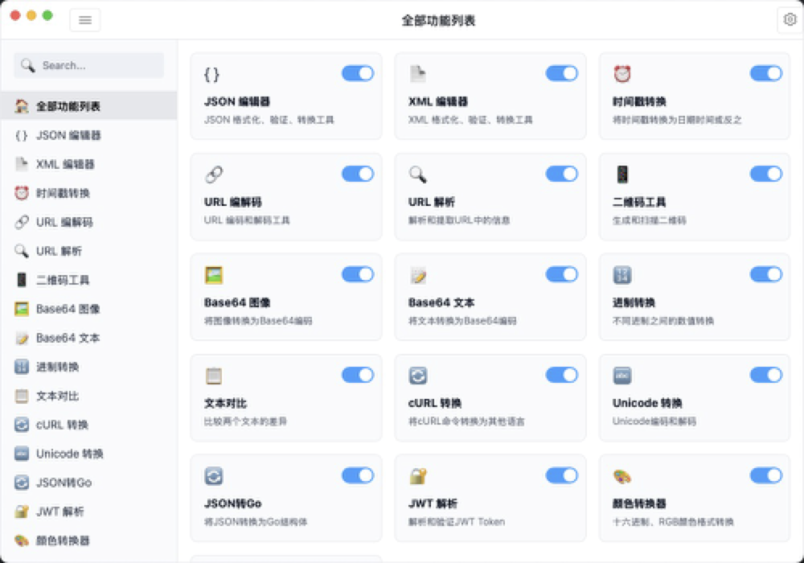
</div>

### 部分功能截图

<div align="center">
  <table>
    <tr>
      <td>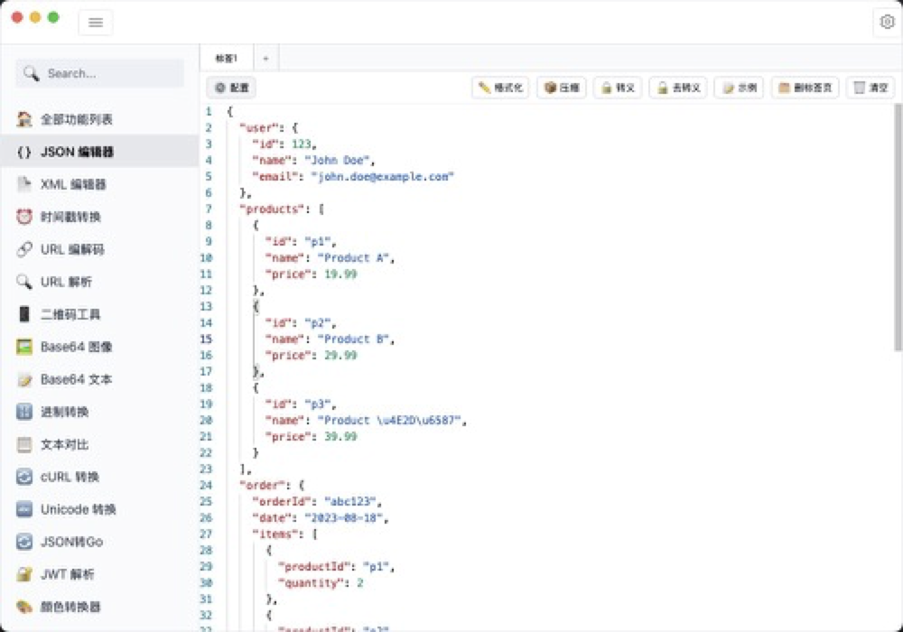</td>
      <td>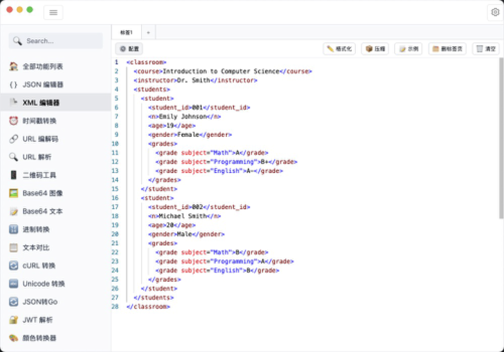</td>
    </tr>
    <tr>
      <td>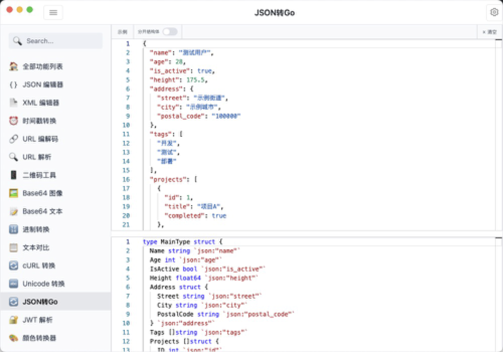</td>
      <td>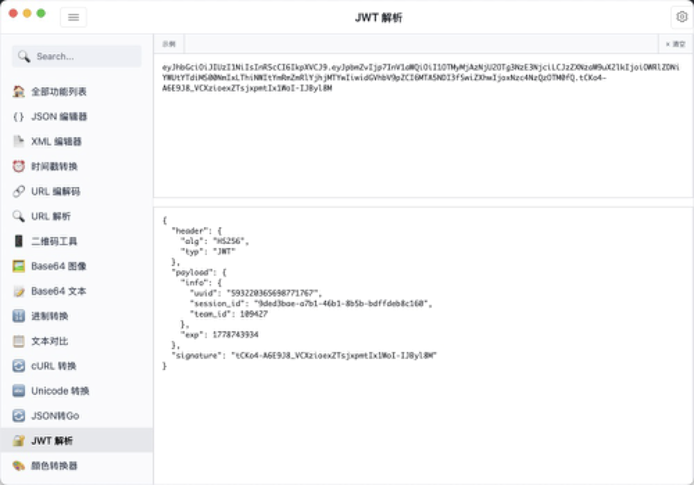</td>
    </tr>
    <tr>
      <td>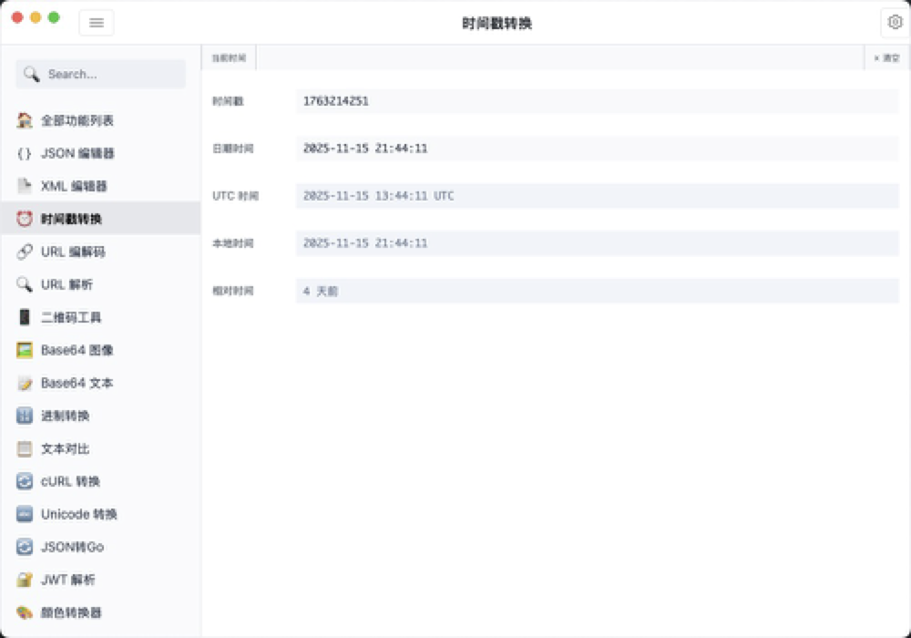</td>
      <td></td>
    </tr>
    <tr>
      <td>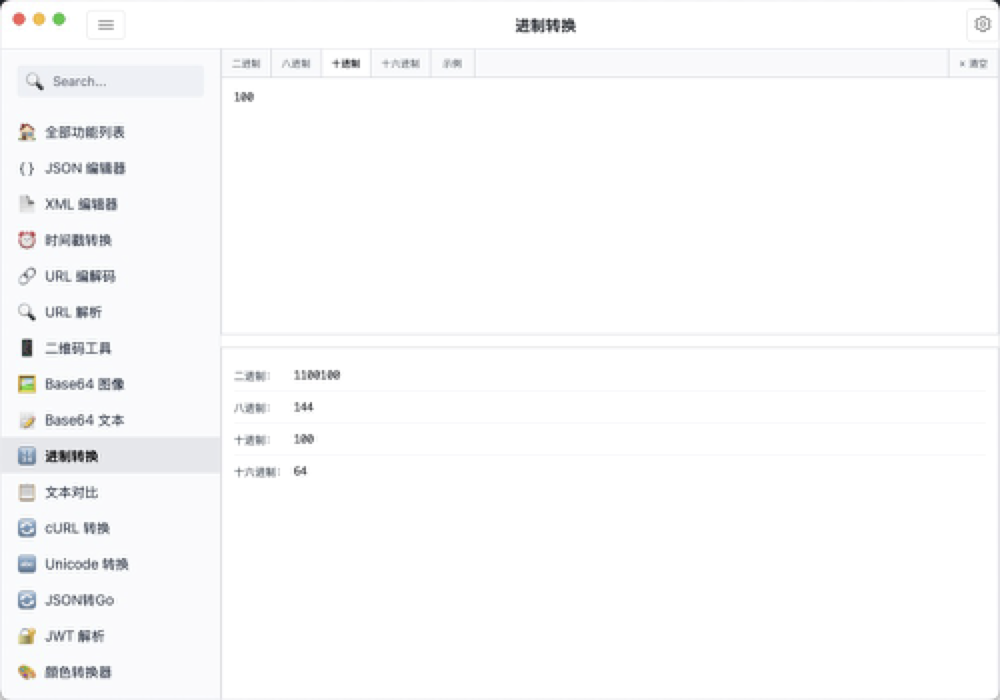</td>
      <td>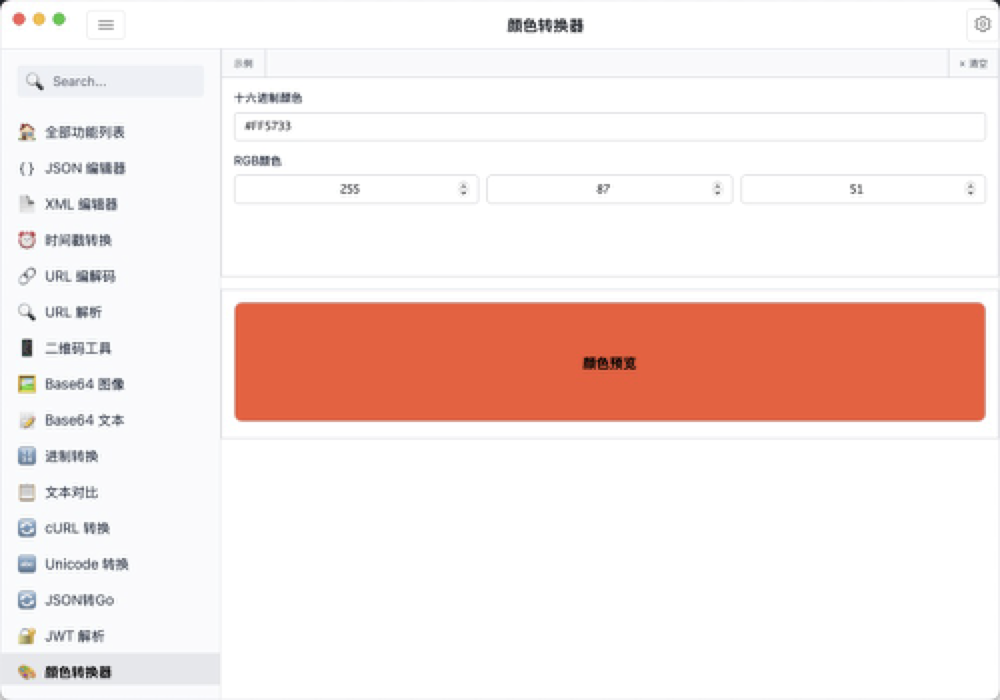</td>
    </tr>
    <tr>
      <td>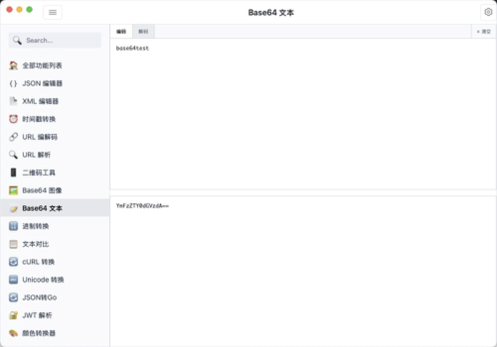</td>
      <td>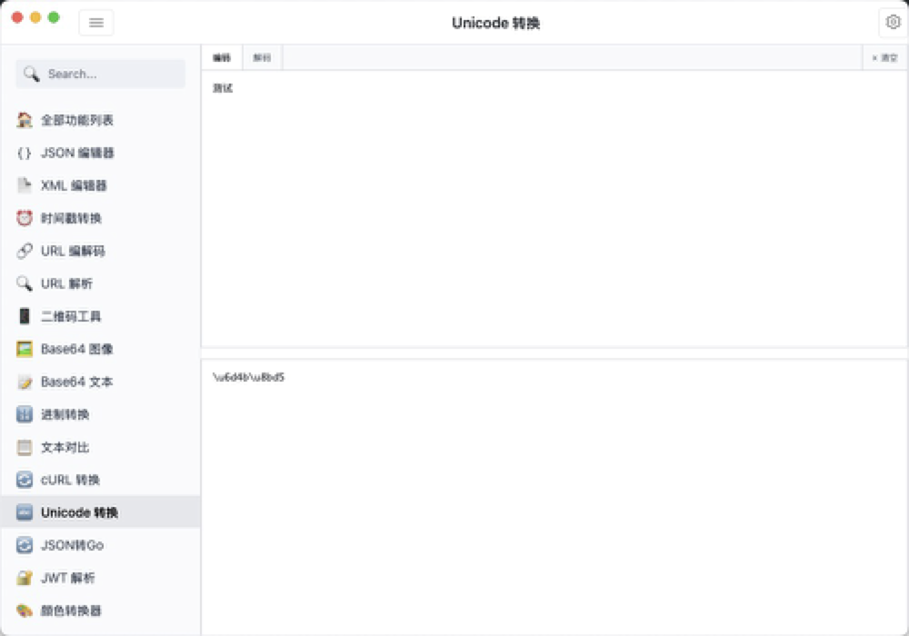</td>
    </tr>
    <tr>
      <td>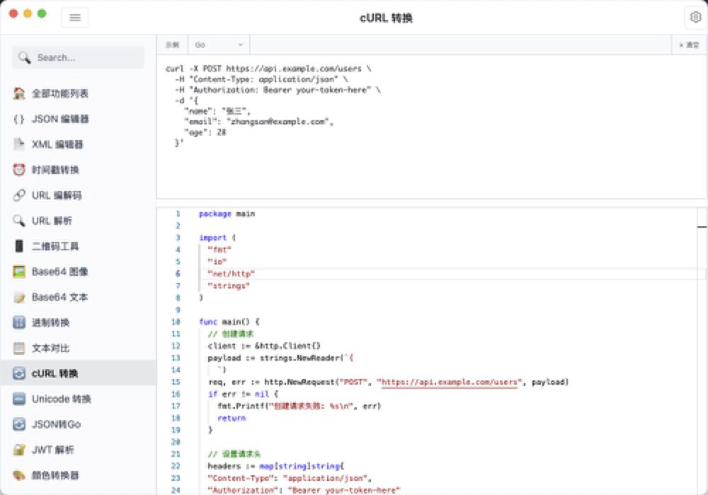</td>
      <td></td>
    </tr>
    <tr>
      <td>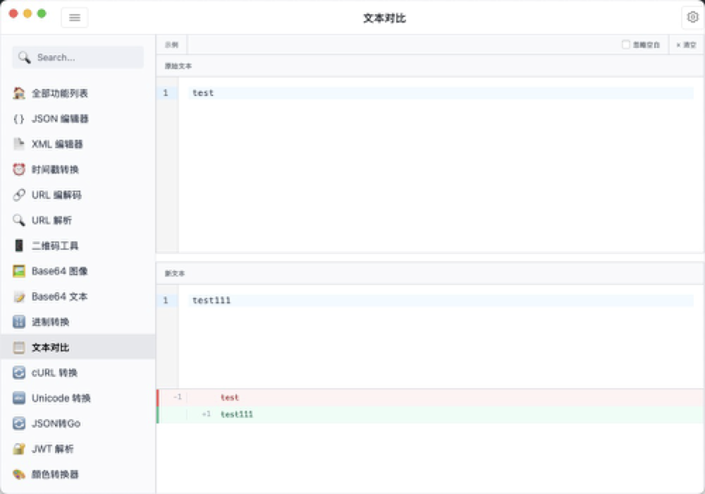</td>
      <td></td>
    </tr>
  </table>
</div>

## 功能特性

- **功能管理**
  - 支持拖拽排序功能卡片
  - 可以显示/隐藏指定功能
  - 排序和显示状态自动保存

- **JSON 编辑器**
  - 格式化、压缩 JSON 数据
  - Unicode 自动解码
  - 语法高亮和错误提示
  - 转义/去转义功能
  - 支持配置自动解码 Unicode
  - 支持去转义时删除换行符和制表符
  - 支持多标签页编辑

- **XML 编辑器**
  - 格式化、压缩 XML 数据
  - 语法高亮
  - 实时编辑预览
  - Monaco Editor 支持
  - 支持多标签页编辑

- **JSON 转 Go**
  - 将 JSON 数据快速转换为 Go 语言结构体
  - 支持自定义结构体名称
  - 智能类型推断
  - 自动生成 json tag

- **JWT 解析**
  - 解析 JWT Token 的 Header 和 Payload
  - 清晰展示 Token 中的所有信息
  - 验证 Token 签名
  - 自动检查 Token 是否过期

- **时间戳转换**
  - 时间戳与日期时间互转
  - 支持毫秒/秒级时间戳
  - 自动识别时间格式
  - 多种时间格式输出

- **URL 工具**
  - URL 编解码转换
  - URL 参数解析与提取
  - 支持批量处理
  - 实时编码结果预览

- **进制转换**
  - 支持二进制、八进制、十进制、十六进制互转
  - 实时转换结果
  - 支持大数值处理
  - 自动进制识别

- **颜色转换**
  - HEX、RGB、HSL 等颜色格式互转
  - 实时预览颜色效果
  - 可视化颜色选择器
  - 一键复制任意格式的颜色值

- **Base64 工具**
  - 文本 Base64 编解码
  - 图片 Base64 转换
  - 支持拖拽上传图片
  - 支持多种图片格式

- **Unicode 工具**
  - Unicode 编码/解码转换
  - 支持批量处理
  - 完美支持中文字符

- **cURL 转换**
  - 将 cURL 命令转换为多种编程语言代码
  - 支持 JavaScript (Fetch)
  - 支持 Python (requests)
  - 支持 Go (net/http)
  - 支持 Go (resty)
  - 支持 Java (OkHttp)
  - 支持 PHP (cURL)
  - 支持 Node.js (Axios)
  - 代码高亮显示

- **二维码工具**
  - 二维码生成
  - 支持自定义内容
  - 实时预览
  - 可下载二维码图片
  - 支持设置容错级别

- **文本对比**
  - 支持对比两段文本的差异
  - 直观的差异显示
  - 支持忽略空白字符
  - 实时对比结果
  - 并排显示，一目了然

## 技术栈

- 前端
  - Vue 3
  - TypeScript
  - Element Plus
  - Monaco Editor
  - Vite

- 后端
  - Go
  - Wails

## 开发环境要求

- Go 1.21+
- Node.js 16+
- Wails 2.5+

## 快速开始

1. 克隆项目

```bash
git clone https://github.com/zzdylan/dev-tools.git
cd dev-tools
```

2. 安装依赖

```bash
# 前端依赖
cd frontend
npm install
cd ..

# 后端依赖
go mod tidy
```

3. 开发模式

```bash
# 启动开发服务器
wails dev
```

4. 构建

```bash
# 构建可执行文件
wails build
```

## 下载安装

提供 Windows 和 macOS 安装包：

- [Windows 版本下载](http://devtools.51godream.com/dev-tools.exe)
- [macOS 版本下载](http://devtools.51godream.com/dev-tools.dmg)

> 如果在 macOS 上安装后无法打开，报错**不受信任**或者**移到垃圾箱**，执行下面命令后再启动即可：
>
> ```shell
> sudo xattr -d com.apple.quarantine /Applications/dev-tools.app
> ```

## 官方网站

访问 [官方网站](http://devtools.51godream.com) 了解更多详细功能介绍。

## License

MIT
